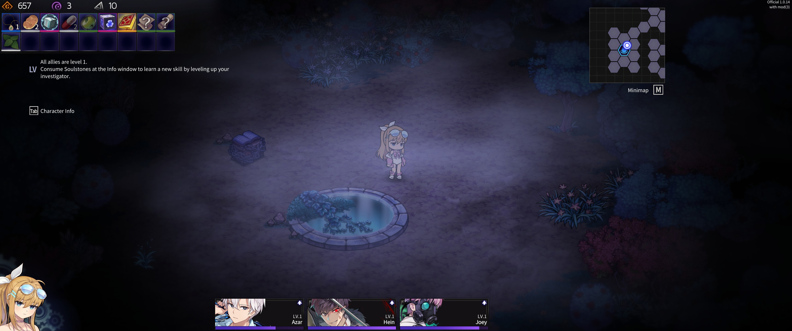

# Chrono Ultrawide Ark
Enables ultrawide 21:9 resolution options for [Chrono Ark](https://store.steampowered.com/app/1188930/_/).

## Requirement
- [Visual Studio Community 2022](https://visualstudio.microsoft.com/)
  - Desktop application development with .Net framework/CSharp.

## Building
You need to set environment variable `ChronoArkGamePath` to game's install directory. (e.g. `steamapps/common/Chrono Ark`).

## LICENSE

[MIT](LICENSE)

